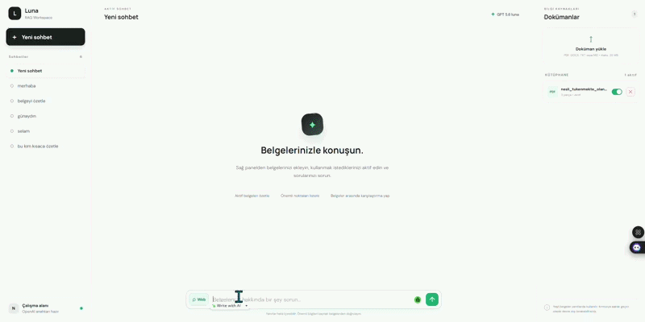

# 🤖 AI RAG Chatbot

A document-based AI chatbot built with **Retrieval-Augmented Generation (RAG)**.
The application allows users to upload documents, retrieve relevant information from them, and generate context-aware answers using an LLM.

🌐 **Live Demo:** https://ai-rag-chatbot-production.up.railway.app/

---

## 🎥 Demo



> The demo shows the chatbot interface, document-based question answering, and the RAG workflow.

---

## ✨ Features

* 📄 Upload and process documents
* ✂️ Text chunking with configurable chunk size and overlap
* 🔢 Local text embeddings
* 🔍 Semantic similarity search with FAISS
* 🤖 LLM-powered answer generation
* 💬 Persistent chat conversations
* 📚 Document management
* 🔐 SHA-256 based duplicate document detection
* 💾 Persistent document and vector index storage
* 🌐 Optional web search integration
* ⚡ FastAPI REST API
* 🚀 Railway deployment

---

## 🧠 What is RAG?

Retrieval-Augmented Generation (RAG) combines information retrieval with Large Language Models.

Instead of asking the LLM to answer a question only from its internal knowledge, the application first searches the user's documents for relevant information and then provides that information as context to the model.

### RAG Pipeline

```text
                📄 Document
                     │
                     ▼
              Text Extraction
                     │
                     ▼
                 Chunking
                     │
                     ▼
                Embedding
                     │
                     ▼
               FAISS Index
                     │
                     │
            ┌────────┴────────┐
            │                 │
            ▼                 │
      User Question           │
            │                 │
            ▼                 │
      Query Embedding         │
            │                 │
            ▼                 │
      Similarity Search ◄─────┘
            │
            ▼
     Relevant Chunks
            │
            ▼
       LLM + Context
            │
            ▼
      Generated Answer
```

---

## 🏗️ Architecture

```text
┌──────────────────────┐
│      Frontend        │
│    HTML / CSS / JS   │
└──────────┬───────────┘
           │
           ▼
┌──────────────────────┐
│       FastAPI        │
│       Backend        │
└──────────┬───────────┘
           │
     ┌─────┴─────┐
     │           │
     ▼           ▼
 Documents    Chat API
     │           │
     ▼           ▼
 Chunking    Retrieval
     │           │
     ▼           ▼
 Embeddings   FAISS
     │           │
     └─────┬─────┘
           │
           ▼
      LLM Generation
           │
           ▼
        Response
```

---

## 🛠️ Tech Stack

| Technology                  | Purpose                      |
| --------------------------- | ---------------------------- |
| **Python**                  | Backend development          |
| **FastAPI**                 | REST API                     |
| **OpenAI API**              | LLM-based answer generation  |
| **Jina Embeddings v5**      | Local text embeddings        |
| **FAISS**                   | Vector similarity search     |
| **HTML / CSS / JavaScript** | Frontend                     |
| **Railway**                 | Deployment                   |
| **Hugging Face**            | Embedding model distribution |

---

## 📂 Project Structure

```text
AI-RAG-Chatbot/
│
├── app/
│   ├── main.py
│   ├── rag.py
│   ├── embeddings.py
│   ├── storage.py
│   └── ...
│
├── data/
│   ├── documents/
│   ├── chunks/
│   └── indexes/
│
├── models/
│   └── jina-embeddings-v5-text-nano/
│
├── tests/
│
├── requirements.txt
├── .env.example
└── README.md
```

---

## ⚙️ How It Works

### 1. Document Ingestion

A document is uploaded through the application.

The backend processes the document and extracts its text content.

### 2. Chunking

The extracted text is divided into smaller chunks.

Chunking makes it possible to retrieve only the relevant parts of a document instead of sending the entire document to the LLM.

### 3. Embedding

Each chunk is converted into a numerical vector representation using the Jina embedding model.

### 4. Vector Search

The embeddings are stored and searched using **FAISS**.

When a user asks a question, the question is also converted into an embedding and compared with the document vectors.

### 5. Retrieval

The most relevant chunks are retrieved based on semantic similarity.

### 6. Generation

The retrieved chunks are provided as context to the LLM.

The model then generates an answer based on the retrieved information.

---

## 🔍 Example Flow

```text
User:
"What does the document say about X?"

        ↓

Query Embedding

        ↓

FAISS Similarity Search

        ↓

Top Relevant Chunks

        ↓

LLM + Retrieved Context

        ↓

Context-Aware Answer
```

---

## 🔐 Document Management

The application uses document identifiers and SHA-256 hashing to help detect duplicate documents.

This prevents the same document from unnecessarily being processed multiple times.

Document-related data and vector indexes are stored persistently.

---

## 🌐 API

The backend is implemented using FastAPI.

Example endpoints include:

```text
GET  /api/status
GET  /api/documents
GET  /api/chats
GET  /api/chats/{chat_id}
POST /api/chats/{chat_id}/messages
POST /api/documents
```

The API is responsible for document management, chat operations, retrieval, and answer generation.

---

## 🚀 Running Locally

### 1. Clone the repository

```bash
git clone https://github.com/Esra404/AI-RAG-Chatbot.git
cd AI-RAG-Chatbot
```

### 2. Create a virtual environment

```bash
python -m venv .venv
```

Activate it on Windows:

```powershell
.venv\Scripts\Activate.ps1
```

### 3. Install dependencies

```bash
pip install -r requirements.txt
```

### 4. Configure environment variables

Create a `.env` file based on `.env.example`.

Example:

```env
OPENAI_API_KEY=your_api_key
```

Add any additional API keys required by your local configuration.

### 5. Start the application

```bash
uvicorn app.main:app --reload
```

The application will be available at:

```text
http://localhost:8000
```

---

## 🚀 Deployment

The application is deployed using **Railway**.

🌐 **Live Interface:**

https://ai-rag-chatbot-production.up.railway.app/

The deployment provides a publicly accessible interface for the application.

---

## ⚠️ Current Deployment Note

The application interface is currently deployed and accessible through Railway.

The local RAG pipeline has been tested during development. However, the current Railway environment has an issue initializing the local Jina embedding model during embedding-dependent operations.

As a result, some production RAG operations such as document ingestion and retrieval may currently be unavailable until the embedding initialization issue is resolved.

This does not affect the overall RAG architecture or local development setup.

---

## 🧪 Testing

The project includes tests for application functionality and API behavior.

During development, the RAG pipeline was tested through:

* Document processing
* Embedding generation
* Vector retrieval
* LLM answer generation
* API endpoints

---

## 📌 Future Improvements

* [ ] Improve production embedding initialization
* [ ] Add more document formats
* [ ] Add source citations to generated answers
* [ ] Improve retrieval evaluation
* [ ] Add configurable Top-K retrieval
* [ ] Add metadata filtering
* [ ] Add authentication
* [ ] Improve conversation management
* [ ] Add RAG evaluation metrics
* [ ] Improve production monitoring

---

## 🎯 Project Goals

This project was developed to explore and demonstrate practical implementation of:

* Retrieval-Augmented Generation
* Vector search
* Embeddings
* Document processing
* LLM integration
* FastAPI backend development
* AI application deployment

The main goal is to understand how a complete RAG pipeline works from **document ingestion to retrieval and answer generation**.

---

## 👩‍💻 Author

**Esra Durmaz**

Computer Engineering Graduate
Backend Development • AI • RAG • LLM Applications

GitHub: https://github.com/Esra404
